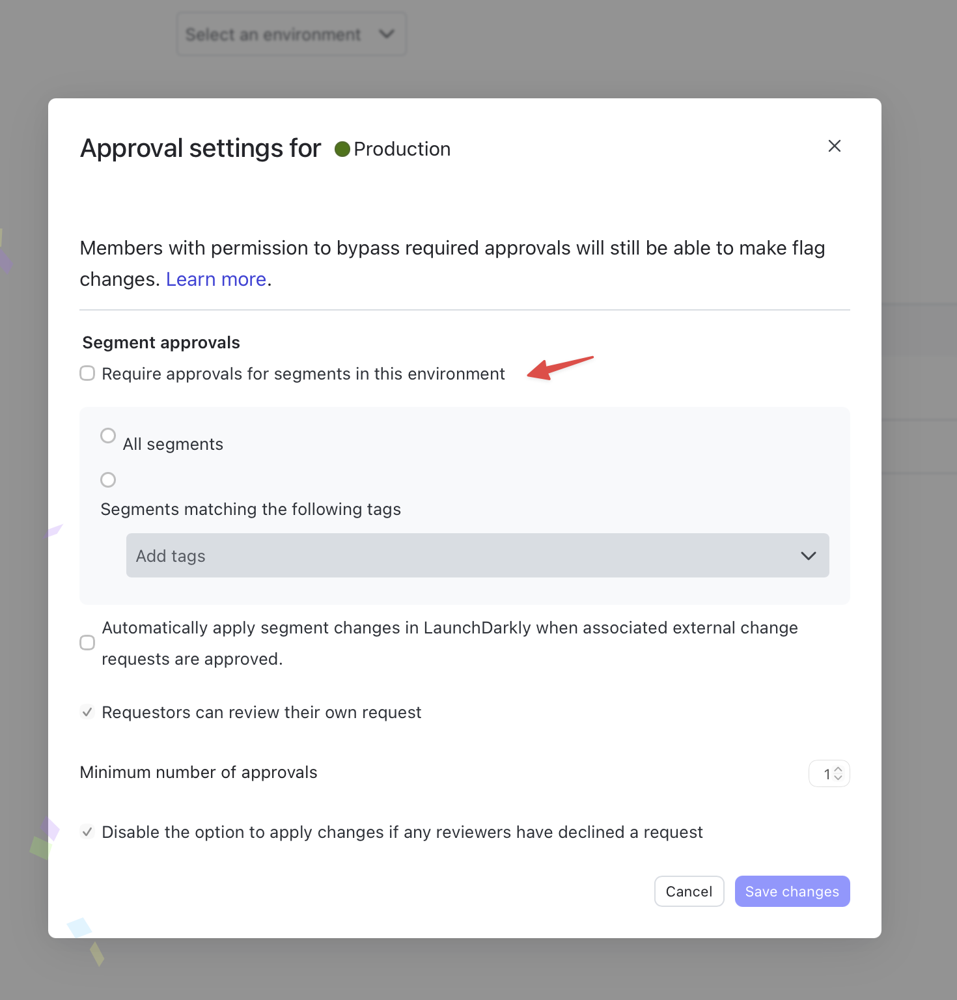
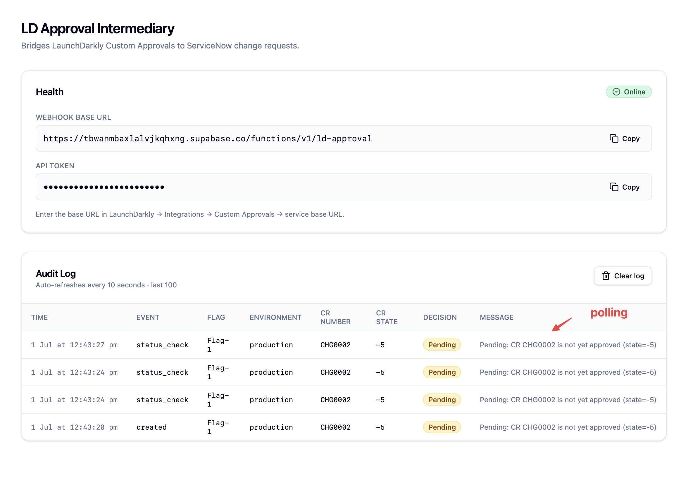
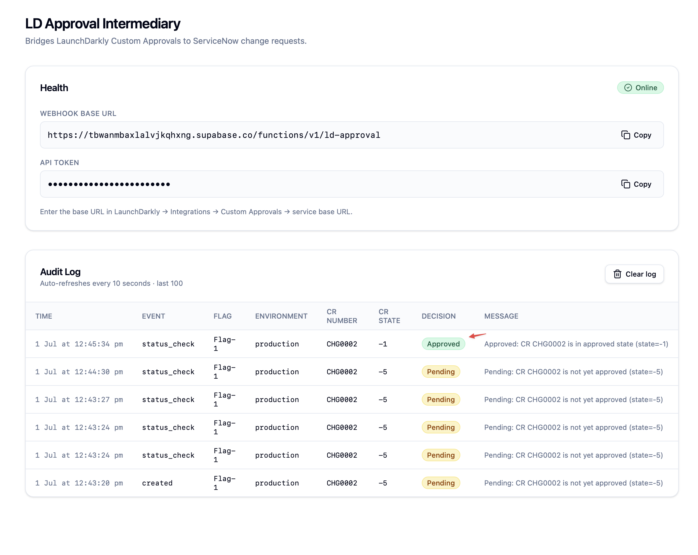
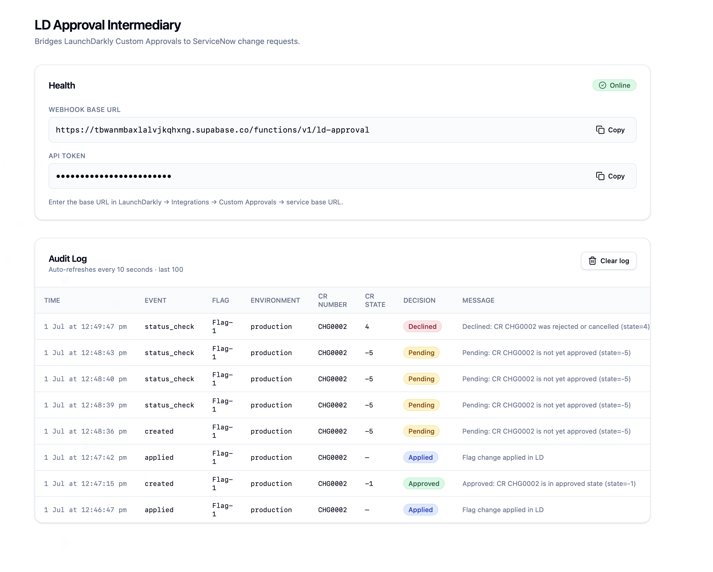

# LaunchDarkly Custom Approvals — ServiceNow Integration Demo

This repository demonstrates how to integrate **LaunchDarkly Custom Approvals** with **ServiceNow Change Requests**. Before any feature flag change can be applied in a production environment, a corresponding ServiceNow Change Request (CR) must exist and be in an approved state.

## What this demonstrates

LaunchDarkly supports a [Custom Approvals](https://launchdarkly.com/docs/integrations/custom-approvals) framework that lets you replace the default LD approval workflow with your own external system. This demo wires LD Custom Approvals to ServiceNow so that:

1. A developer requests a flag change in LaunchDarkly and enters a ServiceNow CR number (e.g. `CHG0001234`)
2. LaunchDarkly sends the approval request to an intermediary service
3. The intermediary checks ServiceNow to see if that CR exists and is in the approved (Implement) state
4. LaunchDarkly polls the intermediary every 5 minutes until the CR is approved
5. Once the CR is approved in ServiceNow, the LD approval status updates to **Approved** and the developer can click **Apply changes** to apply the flag change

## Architecture

```
Developer (LaunchDarkly UI)
    │  submits flag change + CR number
    ▼
LaunchDarkly (cloud)
    │  POST /api/approvals             ← creationRequest
    │  GET  /api/approvals/:id/status  ← statusRequest (polls every 5 min)
    │  POST /api/approvals/:id/apply   ← postApplyRequest
    ▼
LD Approval Intermediary  (Supabase Edge Function)
    │  checks CR state via ServiceNow API
    ▼
ServiceNow  (real instance or mock)
    ▲
    │  ServiceNow admin approves the CR
```

## Repository structure

```
├── LDApprovalIntermediary/     ← LD Custom Approvals intermediary app
│   ├── supabase/
│   │   └── functions/
│   │       └── ld-approval/
│   │           └── index.ts    ← Edge function: handles all LD approval API routes (the only required piece)
│   └── src/                    ← React UI: health status + approval audit log (optional — for demo visibility only)
│
├── ServiceNowMock/             ← Mock ServiceNow instance (for demo/testing)
│   ├── supabase/
│   │   └── functions/
│   │       └── servicenow/
│   │           └── index.ts    ← Edge function: mocks ServiceNow OAuth + Table API
│   └── src/                    ← React UI: create CRs, approve/reject/reset state
│
└── docs/
    └── screenshots/            ← End-to-end demo screenshots
```

## Components

### LDApprovalIntermediary

A Supabase-hosted application that implements the [LaunchDarkly Custom Approvals API contract](https://launchdarkly.com/docs/integrations/custom-approvals/custom-app).

> **In production, only the edge function is required.** The React UI (audit log dashboard) is included for demo purposes only — in a real deployment this would be any HTTP-capable function: an AWS Lambda, Azure Function, Google Cloud Function, or plain Express app. The UI adds zero value to the integration itself.

**Edge function routes:**

| Method | Path | Description |
|--------|------|-------------|
| `POST` | `/api/approvals` | Receives new approval request from LD, checks CR state |
| `GET` | `/api/approvals/:id/status` | LD polls this every 5 min for current CR state |
| `POST` | `/api/approvals/:id/apply` | LD notifies when flag change is applied |
| `DELETE` | `/api/approvals/:id` | LD notifies when approval is cancelled |

**Response shape:**
```json
{ "_id": "<ld-approval-id>", "status": { "value": "approved|declined|pending", "display": "Human readable message" } }
```

**CR state mapping (ServiceNow → LD):**

| ServiceNow state value | Meaning | LD decision |
|------------------------|---------|-------------|
| `-1` | Implement | `approved` |
| `4` | Cancelled | `declined` |
| anything else | New, Assess, Authorize, etc. | `pending` (LD keeps polling) |

**Authentication:** LaunchDarkly sends `Authorization: Bearer <API_TOKEN>` on every request. The token must match the value configured in the LD integration settings.

### ServiceNowMock

A mock ServiceNow instance for demo and testing purposes. Exposes the same API surface as real ServiceNow so the intermediary works without a real ServiceNow subscription.

**Mock API endpoints (Supabase Edge Function):**

- `POST /oauth_token.do` — returns a mock OAuth access token
- `GET /api/now/table/change_request?sysparm_query=number=CHG0001` — returns CR state from the mock database

**UI features:**
- Create new Change Requests
- Approve, Reject, or Reset CR state
- View all CRs and their current state


## LaunchDarkly setup

### Step 1 — Add the Custom Approvals integration

Go to **Organization settings → Integrations → Custom Approvals → Add integration** and configure:

| Field | Value |
|-------|-------|
| Name | Service Now Demo (or any name) |
| API Token | The shared secret (must match `BEARER_TOKEN` in the edge function) |
| Custom approval service base URL | `https://<your-supabase-project>.supabase.co/functions/v1/ld-approval` |
| Additional form variables | See below |

**Additional form variables:**
```json
[{"key":"cr_number","name":"ServiceNow CR Number","type":"string","description":"Enter the CR number (e.g. CHG0001)"}]
```

This causes a **ServiceNow CR Number** field to appear in the LaunchDarkly approval request dialog, where the developer enters the CR number associated with their change.

### Step 2 — Disable Segment approvals (required prerequisite)

> **Important:** If Segment approvals are enabled on the target environment, the LD UI will block saving the Custom Approvals configuration with the error `"Approval settings for serviceKind custom-approvals are only supported for resourceKind 'flag'"`. Disable Segment approvals first.

Go to **Project settings → Approval settings → Segment approvals → [your environment] → Edit approval setting** and untick **"Require approvals for segments in this environment"**, then save.



### Step 3 — Configure Flag approval settings

Go to **Project settings → Approval settings → Flag approvals → [your environment] → Edit approval setting** and:

- Set **Approval system** to your Custom Approvals integration
- Enable **Require approvals for flags in this environment**
- Choose **All flags** or scope to specific tags
- Save changes

### Step 4 — Submit a flag change for approval

When a developer makes a flag change in a configured environment, the **Save changes** dialog shows the **ServiceNow CR Number** field. Enter a valid CR number and click **Request approval**.


## End-to-end demo flow

**1.** Open the **ServiceNow Mock UI** and create a CR (e.g. `CHG0002`) — starts in `new` state.

**2.** In LaunchDarkly, make a flag change in the configured environment. The approval dialog appears with the **ServiceNow CR Number** field. Enter the CR number and click **Request approval**.


**3.** LaunchDarkly sends the approval request to the intermediary. The intermediary checks ServiceNow — CR is in `new` state — returns `pending`. The LD approval page shows **Needs review**.


**4.** LaunchDarkly polls the intermediary every 5 minutes. The audit log in the **LD Approval Intermediary UI** shows each poll as a `status_check` event with decision `Pending`.



**5.** In the **ServiceNow Mock UI**, click **Approve** on the CR — state changes to `implement` (state=-1).

**6.** LaunchDarkly polls again (or refresh the approval page). The intermediary checks ServiceNow — CR is now approved — returns `approved`. The audit log shows the transition.



**7.** The LD approval status updates to **Approved**. The developer clicks **Apply changes** to apply the flag change.


**Declined example:** If the CR is rejected or cancelled in ServiceNow (state=4), the intermediary returns `declined` and LD blocks the flag change.



## Deploying your own instance

### I have a real ServiceNow instance

You only need the **LD Approval Intermediary** — not the ServiceNow Mock. The entire business logic lives in one file:

**[`LDApprovalIntermediary/supabase/functions/ld-approval/index.ts`](LDApprovalIntermediary/supabase/functions/ld-approval/index.ts)**

Use that file as the reference implementation and deploy it to any HTTP-capable function host. One-shot prompts for the two most common targets:

<details>
<summary><strong>AWS Lambda (Node.js/TypeScript)</strong></summary>

```
Build an AWS Lambda function in TypeScript (Node.js 20 runtime) that acts as a
LaunchDarkly Custom Approvals intermediary for ServiceNow.

Reference implementation (Deno edge function with identical logic):
[paste full contents of LDApprovalIntermediary/supabase/functions/ld-approval/index.ts]

Convert it to an AWS Lambda handler using the aws-lambda TypeScript types and
node-fetch (or native fetch, Node 20+). Use an API Gateway proxy event so the
function receives method, path, headers, and body.

Environment variables (read via process.env):
- LD_BEARER_TOKEN      — token LD sends in Authorization: Bearer header
- SERVICENOW_BASE_URL  — e.g. https://company.service-now.com
- SERVICENOW_CLIENT_ID
- SERVICENOW_CLIENT_SECRET
- SERVICENOW_USERNAME
- SERVICENOW_PASSWORD
- SERVICENOW_APPROVED_STATE  — numeric state value for approved (e.g. -1)
- SERVICENOW_REJECTED_STATES — comma-separated numeric state values for rejected (e.g. 4,8)

No database needed — the function is stateless. For the statusRequest
(GET /api/approvals/:id/status), store approval_id→cr_number mapping in
DynamoDB (table name via env var DYNAMODB_TABLE). For postApplyRequest and
deletionRequest just return HTTP 200 with empty body.

Include a SAM template (template.yaml) with the API Gateway + Lambda definition
and all environment variables as parameters.
```

</details>

<details>
<summary><strong>Azure Function (TypeScript, HTTP trigger)</strong></summary>

```
Build an Azure Function in TypeScript (Node.js 20, Azure Functions v4 programming
model) that acts as a LaunchDarkly Custom Approvals intermediary for ServiceNow.

Reference implementation (Deno edge function with identical logic):
[paste full contents of LDApprovalIntermediary/supabase/functions/ld-approval/index.ts]

Use a single HTTP-triggered function with route template
`api/approvals/{*rest}` so it catches all four LD routes:
  POST   /api/approvals
  GET    /api/approvals/{id}/status
  POST   /api/approvals/{id}/apply
  DELETE /api/approvals/{id}

Environment variables (read via process.env):
- LD_BEARER_TOKEN
- SERVICENOW_BASE_URL
- SERVICENOW_CLIENT_ID
- SERVICENOW_CLIENT_SECRET
- SERVICENOW_USERNAME
- SERVICENOW_PASSWORD
- SERVICENOW_APPROVED_STATE
- SERVICENOW_REJECTED_STATES  (comma-separated)

For the statusRequest (GET .../status), store approval_id→cr_number mapping
in Azure Table Storage (connection string via AZURE_STORAGE_CONNECTION_STRING,
table name via TABLE_NAME env var). For postApplyRequest and deletionRequest
return HTTP 200 with empty body.

Include host.json, local.settings.json.example, and a Bicep file
(main.bicep) that provisions the Function App, Storage Account, and
App Service Plan.
```

</details>

### I want to use the Lovable/Supabase setup from this repo

1. Fork this repo and import `LDApprovalIntermediary/` into Lovable
2. Lovable provisions a Supabase project automatically
3. Copy `.env.example` to `.env` and fill in your Supabase credentials
4. Update `BEARER_TOKEN` and `SNOW_BASE` in `LDApprovalIntermediary/supabase/functions/ld-approval/index.ts`
5. Deploy via Lovable's built-in publish flow

## Real ServiceNow integration

To connect to a real ServiceNow instance instead of the mock:

1. In ServiceNow: **System OAuth → Application Registry → New → Create an OAuth API endpoint for external clients**
2. Note the Client ID and Client Secret
3. Update the edge function's `SNOW_BASE` URL and OAuth credentials to point at your ServiceNow instance
4. Set `APPROVED_STATE` to the numeric state value your team uses for approved CRs (commonly `-1` for Implement)
5. Set `REJECTED_STATES` to numeric state values for cancelled/rejected CRs (commonly `4` for Cancelled, `8` for Closed Incomplete)
